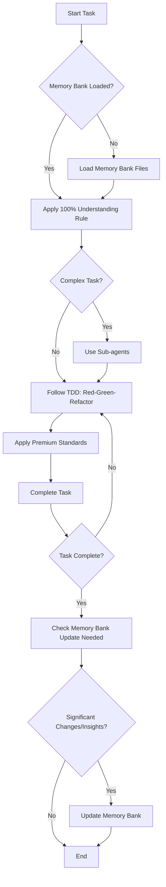

# MUST following workflow:

# Sub-agents usage
- You should use sub-agents to handle each user request.
- Each sub-agent should be focused on a specific task or module.
- Sub-agents help maintain focus and provide better results for complex tasks
- **ENFORCE**: Always use sub-agents when possible, especially for:
  - File analysis and code examination
  - Implementation of new features or bug fixes
  - Code modifications and updates
  - Research tasks across multiple files
  - Complex problem-solving that requires multiple steps